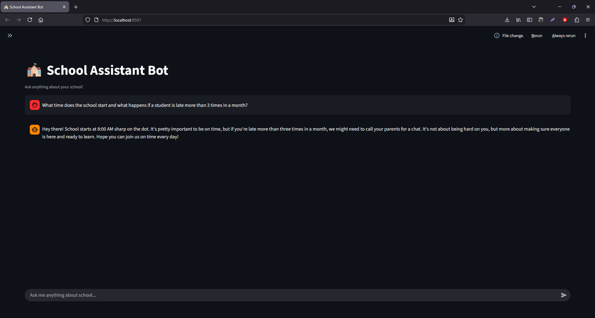

# 🏫 School Assistant Bot - AI-Powered Q&A System

An intelligent School Assistant Bot built with Generative AI and RAG (Retrieval-Augmented Generation) technology. This project demonstrates how AI can provide accurate, context-aware answers about school information by combining semantic search with large language models.



[] [] [] []

## 🎯 Project Overview

This project implements a smart Q&A system that answers questions about school rules, schedules, and facilities. Unlike standard chatbots, it uses RAG architecture to provide factual, reliable answers based on custom school knowledge rather than generic information.

## ✨ Key Features

- 🤖 **Intelligent Q&A**: Get accurate answers about school information
- 🔍 **Semantic Search**: Finds most relevant information using ChromaDB
- 💬 **Beautiful Web Interface**: Streamlit-based chat interface
- 🎯 **Context-Aware**: Understands questions and provides reasoned answers
- 🚀 **Fast & Responsive**: Real-time AI responses
- 🔒 **Privacy-Focused**: Your data stays with you

## 🛠️ Technology Stack

| Component       | Technology          | Purpose                          |
|-----------------|---------------------|----------------------------------|
| AI Model        | Google Gemini API   | Generative AI responses          |
| Vector Database | ChromaDB            | Semantic search & knowledge retrieval |
| Web Framework   | Streamlit           | User interface                   |
| Language        | Python 3.8+         | Backend logic                    |
| Architecture    | RAG (Retrieval-Augmented Generation) | Accurate AI responses |

## 📋 Prerequisites

Before running this project, ensure you have:

- Python 3.8 or higher
- Google Gemini API key [](https://makersuite.google.com/app/apikey)
- Basic understanding of Python and AI concepts

## 🚀 Quick Setup

### Step 1: Clone the Repository

```
git clone https://github.com/yourusername/school-assistant-bot.git
cd school-assistant-bot
```

### Step 2: Create Virtual Environment (Recommended)
```
python -m venv venv

# on Ubuntu:
source venv/bin/activate  

# On Windows: 
venv\Scripts\activate
```

### Step 3: Install Dependencies
```
pip install -r requirements.txt
```

### Step 4: Set Up API Key
Create a .streamlit/secrets.toml file:
```
GEMINI_API_KEY = "your_gemini_api_key_here"
GEMINI_MODEL = "your_gemini_model_name_here"
HUGGINGFACEHUB_API_TOKEN = "your_huggingface_api_key_here"
```

and create a .env file as well:
```
GEMINI_API_KEY = "your_gemini_api_key_here"
GEMINI_MODEL = "your_gemini_model_name_here"
HUGGINGFACEHUB_API_TOKEN = "your_huggingface_api_key_here"
```

### Step 5: Run the Application
```
streamlit run app.py
```

### Step 6: Access the Bot
Open your browser and go to: http://localhost:8501

## 💡 How It Works
### Architecture Flow
```
User Question → Semantic Search → Relevant Facts → AI Generation → Final Answer
      ↓              ↓               ↓              ↓              ↓
   Input →     ChromaDB Vector   → School Facts → Gemini AI → Response
              Database Search
```

1. **Knowledge Base Setup**
   - School information is stored as vector embeddings in ChromaDB
   - Includes rules, schedules, facilities, and policies

2. **Question Processing**
   - User asks a question through the web interface
   - System performs semantic search to find relevant facts

3. **Intelligent Response Generation**
   - Combines retrieved facts with the original question
   - Uses Gemini AI to generate contextual, accurate answers
   - Provides reasoning and direct responses

## 🎨 Usage Examples

Try asking these questions:

- "When is the library open?"
- "Can anyone join the basketball team?"
- "What do I need to join sports teams?"
- "Who is the principal?"
- "Is computer lab available after school?"

## 📁 Project Structure
```
school-assistant-bot/                     # AI-powered School Assistant using LangChain + Gemini + ChromaDB
├── app.py                          # Main Streamlit application (entry point)
├── requirements.txt                # Project dependencies
├── README.md                       # This file
├── .streamlit/
│   └── secrets.toml                # API keys & configuration (git ignored)
│
├── config/                         # Application-wide constants & settings
│   └── settings.py
│
├── core/                           # LLM and prompt related logic
│   ├── __init__.py
│   ├── llm.py                      # Google Gemini model initialization
│   └── prompt_templates.py         # System & chat prompt definitions
│
├── rag/                            # Retrieval-Augmented Generation components
│   ├── __init__.py
│   ├── vectorstore.py              # Chroma vector database management
│   ├── retriever.py                # Document retrieval logic
│   └── chain.py                    # Full RAG chain (retriever + prompt + LLM)
│
├── data/
│   ├── school_docs/                  ← ← ← PUT YOUR PDFs HERE
│   │   ├── school_rules_2025.pdf
│   │   ├── timetable_2025-26.pdf
│   │   ├── admission_policy.pdf
│   │   └── ...
│   └── school_knowledge_loader.py    ← new file: loads & processes PDFs
│
├── utils/                          # General utilities & helpers
│   ├── __init__.py
│   └── helpers.py                  # Session state, formatting helpers, etc.
│
└── chroma_db/                      # Persistent ChromaDB storage (git ignored)
    └── ... (generated files)
```

## 🔧 Customization – Adding Your Own School Information

The bot now loads school knowledge **automatically from PDF files** instead of using a hardcoded list.  
This makes it much easier to maintain large amounts of information (rules, timetables, policies, syllabus, etc.).

### Step-by-step: How to add or update school information

1. **Prepare your PDF files**
   - Gather all relevant school documents (PDF format only)
   - Good examples:
     - School rules & regulations
     - Academic calendar / timetable
     - Admission policy
     - Fee structure
     - Library guidelines
     - Sports & extracurricular rules
     - Any other official school information

2. **Place the PDFs in the correct folder**
```
school-assistant-bot/
├── data/
│   ├── school_docs/               ← ← ← PUT ALL YOUR PDFs HERE
│   │   ├── school_rules_2025-26.pdf
│   │   ├── academic_calendar.pdf
│   │   ├── fee_structure_2026.pdf
│   │   ├── library_guidelines.pdf
│   │   └── ...
```

3. **(Re)start the application**
- The system automatically:
  - Scans the `data/school_docs/` folder
  - Extracts text from all `.pdf` files
  - Splits content into meaningful chunks
  - Stores everything in the Chroma vector database

**Important:**  
To apply changes (add new PDFs, replace existing ones, or update content):
- Add/remove/modify files in `data/school_docs/`
- **Delete the `chroma_db/` folder** (to force re-indexing)  
  ```bash
  # On Windows
  rmdir /s /q chroma_db

  # On Linux/Mac
  rm -rf chroma_db

### Modifying the AI Behavior
Adjust the prompt template in the full_prompt variable:
```
full_prompt = f"""
You are a very friendly, kind and helpful school assistant.
Talk naturally like a supportive older sibling.

Use only the provided school information below to answer.
If you don't have enough information or the topic is not covered — say it honestly.

School information:
{context}

Question: {question}

Answer in natural, conversational style.
Do NOT use numbered lists unless the question is clearly asking for steps or ranking.
Be warm, clear and supportive.Just write a helpful, friendly reply like you would say it in person.

Important: Only use numbers 1. 2. etc. when the question is clearly asking for steps or multiple separate points.  
For normal questions, write like a normal conversation.

Answer:"""
```

# 🌟 Learning Outcomes
This project demonstrates:

- RAG Architecture: Combining retrieval and generation for accurate AI
- Vector Databases: Using ChromaDB for semantic search
- API Integration: Working with Google Gemini AI
- Web Development: Building interactive UIs with Streamlit
- AI Prompt Engineering: Crafting effective prompts for better responses

# 🤝 Contributing
Contributions are welcome! Feel free to:

- Fork the project
- Create a feature branch
- Submit a pull request

# 📝 License
This project is open source and available under the MIT License.

# 🔗 Connect With Me
 

# 🚀 Future Enhancements
- Voice input/output capabilities
- Multi-language support
- Integration with school databases
- Mobile app version
- Admin panel for knowledge base management

### ⭐ If you find this project helpful, please give it a star on GitHub!
Built with ❤️ using Python, Streamlit, and Google Gemini AI